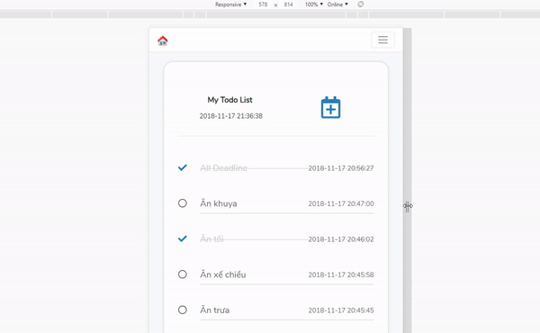

<h1>Demo Seminar WEB1 - Team F5</h1>
<h2>Laravel 5.7</h2>



Clone
============
```bash
git clone https://github.com/anhvietcr/seminar-web1.git
composer update
```

### Installing via Composer (If Composer not exists)

- Go Home and Install [Composer](http://getcomposer.org).

- Init composer
```bash
# Init Composer
composer init
```

Config
============
- Install Mysql (web1_seminar)
- /config/database.php
- .env


Author
============
**Anhvietcr** [fb.com/anhvietcr] (https://facebook.com/anhvietcr)
